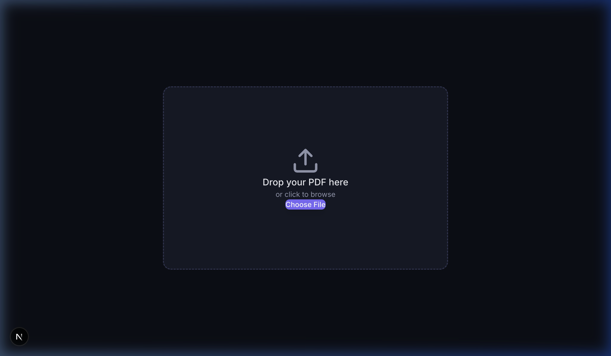

<div align="center">

# 📐 PDF Coordinate Picker

**Stop guessing PDF coordinates. Click to pick, AI to auto-detect — export ready for pdf-lib in seconds.**

[](LICENSE)
[](https://nextjs.org)
[](https://react.dev)
[](https://typescriptlang.org)
[](https://ai.google.dev)

<br />

<!-- Replace with a GIF once available -->


*Upload any PDF → click to pick coordinates → export JSON for pdf-lib, ReportLab, iText, and more.*

[🚀 Live Demo](#) · [📖 Docs](#features) · [🐛 Report Bug](https://github.com/thinkfirstailater/pdf-coordinate-picker/issues/new?template=bug_report.md) · [💡 Request Feature](https://github.com/thinkfirstailater/pdf-coordinate-picker/issues/new?template=feature_request.md)

</div>

---

## Why This Exists

| 😤 The Problem | ✅ The Solution |
|---|---|
| PDF libraries like `pdf-lib` use coordinate-based positioning — but there's **no visual way** to find the right `(x, y)` | **Click anywhere** on a PDF to instantly get precise coordinates |
| You waste 30+ minutes doing trial-and-error: guess → generate → check → repeat | **See coordinates in real-time** as you move your cursor, pick with one click |
| Form PDFs have dozens of fields — manually finding each coordinate is tedious and error-prone | **AI Auto-Pick** (Gemini) detects all fillable fields on a page in one click |

## Quickstart

```bash
# Clone & install
git clone https://github.com/thinkfirstailater/pdf-coordinate-picker.git
cd pdf-coordinate-picker
npm install

# (Optional) Set up server-side API key for AI Auto-Pick
# If skipped, you can still enter your Gemini API key directly in the web UI!
cp .env.example .env.local
# Edit .env.local and add your GOOGLE_AI_API_KEY

# Run
npm run dev
```

Open [http://localhost:3000](http://localhost:3000) — drop a PDF and start picking! 🎯

## Features

### 🎯 Core

| Feature | Description |
|---|---|
| **PDF Upload** | Drag & drop or click to upload PDF files (up to 10MB) |
| **Click-to-Pick** | Click anywhere on the PDF to capture exact coordinates |
| **4 Origin Systems** | Bottom-Left (pdf-lib), Top-Left (Screen), Bottom-Right, Top-Right |
| **Drag to Adjust** | Drag placed points to fine-tune position |
| **Multi-page** | Navigate between pages with thumbnail sidebar |
| **Zoom** | Zoom in/out for pixel-perfect precision |
| **Grid Overlay** | Toggle coordinate grid with labeled axes |
| **Real-time Display** | Live coordinate readout follows your cursor |
| **Export JSON** | Download all coordinates as structured JSON |
| **Keyboard Shortcuts** | `Ctrl+Z` undo, `Delete` remove selected point |

### ✨ AI Auto-Pick (Powered by Gemini)

> One click to detect all fillable form fields on a page.

The AI analyzes the PDF text layer and automatically identifies:
- 📝 **Text inputs** — name, address, ID number fields
- ☑️ **Checkboxes** — options, selections
- 📅 **Date fields** — date of birth, issue date
- ✍️ **Signature areas** — signature blocks

It works especially well with complex forms (government documents, multi-language VN/EN forms).

**How it works**: Extracts text items via `pdf.js` → sends to Gemini API → receives labeled coordinates → places markers on the PDF.

## Tech Stack

| Technology | Purpose |
|---|---|
| [Next.js 16](https://nextjs.org) | App framework with API routes |
| [React 19](https://react.dev) | UI rendering |
| [TypeScript 5](https://typescriptlang.org) | Type safety |
| [react-pdf](https://github.com/wojtekmaj/react-pdf) / [pdf.js](https://mozilla.github.io/pdf.js/) | PDF rendering & text extraction |
| [Google Gemini](https://ai.google.dev) | AI-powered field detection |
| [Lucide React](https://lucide.dev) | Icons |
| [Tailwind CSS 4](https://tailwindcss.com) | Styling |

## Roadmap

- [x] Visual coordinate picking with click
- [x] Multiple coordinate origin systems
- [x] Grid overlay with labeled axes
- [x] Drag-to-adjust points
- [x] AI auto-pick form fields (Gemini)
- [x] JSON export
- [ ] Live demo deployment (Vercel)
- [ ] Demo GIF / screenshot in README
- [ ] Copy single coordinate to clipboard on click
- [ ] Support area selection (rectangle regions)
- [ ] PDF text layer toggle (show/hide text)
- [ ] Custom grid spacing
- [ ] Import/load previously exported coordinates
- [ ] Support more AI models (OpenAI, Claude)
- [ ] Batch processing (multi-page auto-pick)
- [ ] Browser extension version

## 🔒 Privacy & Security (Zero-Log Policy)

We take API key safety and privacy seriously:
- **Server Key Default**: If `GOOGLE_AI_API_KEY` is set on the server/deployment, visitors can use AI Auto-Pick out-of-the-box without entering any credentials.
- **Client Fallback (Zero-Log)**: If no server key exists (or if you choose to override with your own key), your API key is saved solely in your local browser storage (`localStorage`).
- **Stateless Requests**: Custom keys are transmitted on-demand via HTTPS request headers directly to the API handler for immediate execution.
- **Zero-Storage Guarantee**: The server processes requests in-memory and **never logs, stores, tracks, or persists** user API keys or document contents.

## Contributing

Contributions are welcome! See [CONTRIBUTING.md](CONTRIBUTING.md) for setup instructions and guidelines.

Check the [roadmap](#roadmap) for items marked with `[ ]` — these are great places to start. Look for issues labeled [`good first issue`](https://github.com/thinkfirstailater/pdf-coordinate-picker/labels/good%20first%20issue) for beginner-friendly tasks.

## Acknowledgments

This project was inspired by [**pdf-lib-pointer**](https://pdf-lib-pointer.vercel.app/) — a clean, minimal PDF coordinate pointer tool. We built upon that idea and extended it with AI-powered auto-detection, multiple coordinate origin systems, drag-to-adjust, grid overlay, and structured JSON export. Thank you for the original inspiration! 🙏

## License

MIT © [vtran](https://github.com/thinkfirstailater) — see [LICENSE](LICENSE) for details.